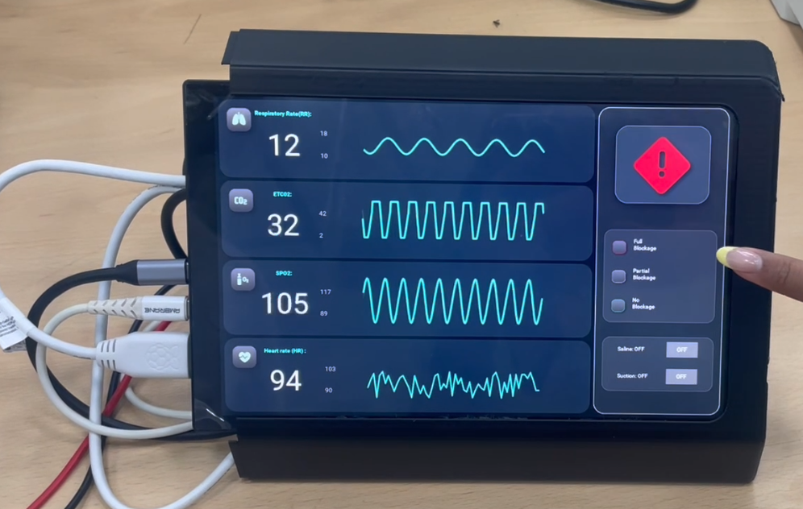
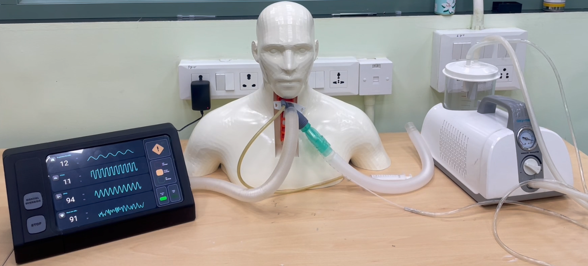

# Tracheostomy Device UI

- [Tracheostomy Device UI](#tracheostomy-device-ui)
  - [Features](#features)
  - [Requirements](#requirements)
  - [GPIO Control](#gpio-control)
  - [DEMO](#demo)

The Tracheostomy-Device-UI built with Kivy optimized for touch devices, runs on a Raspberry Pi. UI is designed for monitoring and detecting tracheostomy tube blockages. This UI simulates real-time data on respiratory rate (RR), CO2, SpO2, and heart rate (HR), with integrated blockage detection and buzzer alerts.

 

 

## Features

- Blockage Detection: Detects No Blockage, Partial Blockage, or Full Blockage.
- Buzzer Alerts:
  - Full Blockage: 330Hz beep every 0.6s.
  - Partial Blockage: 440Hz beep every 1.8s.
  - No Blockage: Silent.
- Real-Time Monitoring: Displays live data with graphs for RR, CO2, SpO2, and HR.

## Requirements

- Hardware: Raspberry Pi, buzzer, monitoring sensors (CO2, SpO2, HR), display.
- Software: Python 3.x, Kivy, RPi.GPIO.

## GPIO Control

The buzzer is connected to GPIO pin 18 and is controlled based on blockage status.

## DEMO

https://github.com/user-attachments/assets/8187812e-a059-434e-875c-af4dcb2aa6dd
